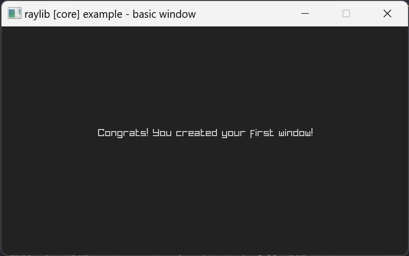

# raylib-bindings

This repo contains pocketpy bindings for raylib.

**Current raylib version: `5.5`**

## Requirements

+ Python 3.9 or higher

## Generate raylib's bindings

```
pip install pycparser

python gen_raylib.py
```

This generates two files:

+ [output/raylib.c](https://github.com/pocketpy/raylib-bindings/blob/main/output/raylib.c)
+ [output/raylib.pyi](https://github.com/pocketpy/raylib-bindings/blob/main/output/raylib.pyi)

You can take these two files directly into your project.

## Write a `main.py` file

```python
import raylib as rl

rl.InitWindow(800, 450, "raylib [core] example - basic window")

RAYWHITE = rl.Color(34, 34, 34, 255)
LIGHTGRAY = rl.Color(200, 200, 200, 255)

while not rl.WindowShouldClose():
    rl.BeginDrawing()
    rl.ClearBackground(RAYWHITE)
    rl.DrawText("Congrats! You created your first window!", 190, 200, 20, LIGHTGRAY)
    rl.EndDrawing()

rl.CloseWindow()
```

## Build the example

```bash
cmake -B build -DCMAKE_BUILD_TYPE=Release
cmake --build build --config Release

./build/raylib_test
```



## Limitations

+ variadic functions are not supported
+ callbacks are not supported

## References

+ [pocketpy](https://github.com/pocketpy/pocketpy)
+ [raylib](https://github.com/raysan5/raylib)

## License

MIT License
